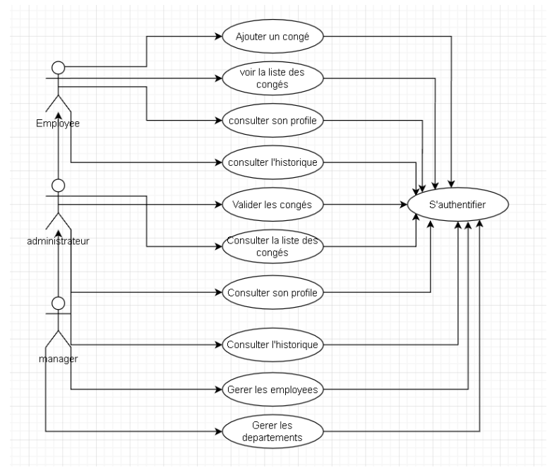
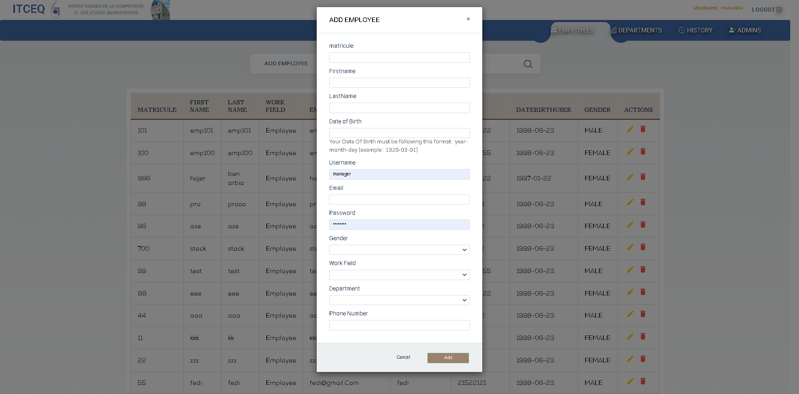
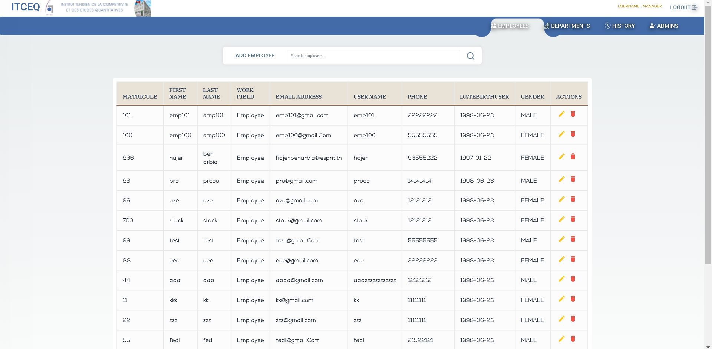
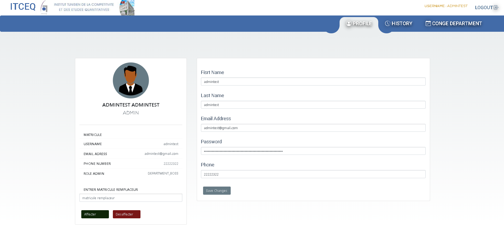
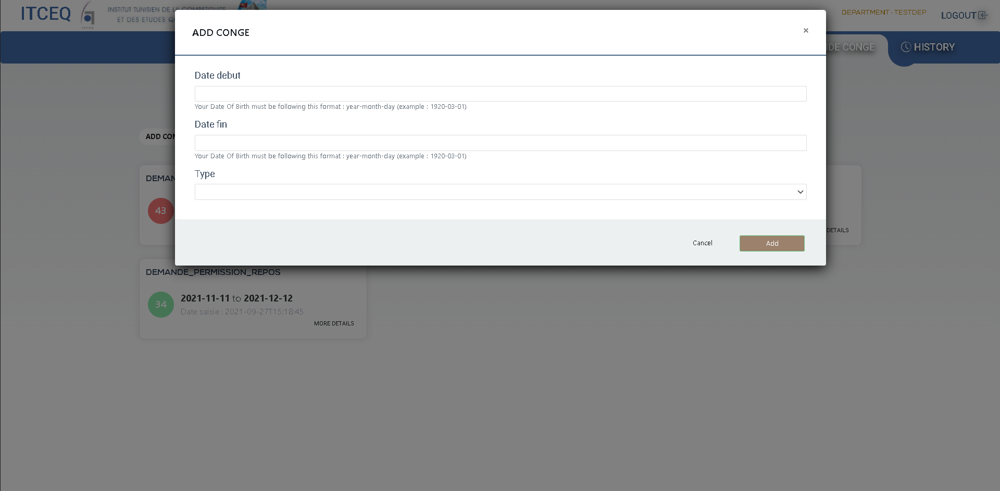

# Web application for leave management using Angular

## creenshots
Use Case Diagram




The manager can add employees, departments, department heads and assign each of them to another. 



The employee will log in using a username and email address that was sent to him in the mail. 
He can check and update certain information in his profile if necessary.


He can request leaves and check the history and status of his current requests.


The employees will wait until


> [Angular + Spring Boot: JWT Authentication & Authorization example](https://bezkoder.com/angular-11-spring-boot-jwt-auth/)

Run `ng serve` for a dev server. Navigate to `http://localhost:4200/`.

## With Node.js Express back-end

> [Angular + Node.js Express: JWT Authentication & Authorization example](https://bezkoder.com/node-js-express-angular-10-jwt-auth/)

Open `app/_helpers/auth.interceptor.js`, modify the code to work with **x-access-token** like this:
```js
...

// const TOKEN_HEADER_KEY = 'Authorization'; // for Spring Boot back-end
const TOKEN_HEADER_KEY = 'x-access-token';   // for Node.js Express back-end

@Injectable()
export class AuthInterceptor implements HttpInterceptor {
  ...

  intercept(req: HttpRequest<any>, next: HttpHandler): Observable<HttpEvent<any>> {
    ...
    if (token != null) {
      // for Spring Boot back-end
      // authReq = req.clone({ headers: req.headers.set(TOKEN_HEADER_KEY, 'Bearer ' + token) });

      // for Node.js Express back-end
      authReq = req.clone({ headers: req.headers.set(TOKEN_HEADER_KEY, token) });
    }
    return next.handle(authReq);
  }
}

...
```

Run `ng serve --port 8081` for a dev server. Navigate to `http://localhost:8081/`.

## More practice
> [Angular 11 CRUD Application example with Web API](https://bezkoder.com/angular-11-crud-app/)

> [Angular 11 Pagination example | ngx-pagination](https://bezkoder.com/angular-11-pagination-ngx/)

> [Angular 11 File Upload example with progress bar](https://bezkoder.com/angular-11-file-upload/)

Fullstack with Node.js Express:
> [Angular 11 + Node.js Express + MySQL](https://bezkoder.com/angular-11-node-js-express-mysql/)

> [Angular 11 + Node.js Express + PostgreSQL](https://bezkoder.com/angular-11-node-js-express-postgresql/)

> [Angular 11 + Node.js Express + MongoDB](https://bezkoder.com/angular-11-mongodb-node-js-express/)

Fullstack with Spring Boot:
> [Angular 11 + Spring Boot + MySQL](https://bezkoder.com/angular-11-spring-boot-crud/)

> [Angular 11 + Spring Boot + PostgreSQL](https://bezkoder.com/angular-11-spring-boot-postgresql/)

> [Angular 11 + Spring Boot + MongoDB](https://bezkoder.com/angular-11-spring-boot-mongodb/)

> [Angular 11 + Spring Boot: File upload example](https://bezkoder.com/angular-11-spring-boot-file-upload/)

> [Angular 11 + Spring Boot: Pagination example](https://bezkoder.com/pagination-spring-boot-angular-11/)

Fullstack with Django:
> [Angular 11 + Django Rest Framework](https://bezkoder.com/django-angular-11-crud-rest-framework/)

> [Angular 11 + Django + PostgreSQL](https://bezkoder.com/django-angular-postgresql/)

Serverless with Firebase:
> [Angular 11 Firebase CRUD Realtime DB | AngularFireDatabase](https://bezkoder.com/angular-11-firebase-crud/)

> [Angular 11 Firestore CRUD | AngularFireStore](https://bezkoder.com/angular-11-firestore-crud-angularfirestore/)

> [Angular 11 Upload File to Firebase Storage: Display/Delete Files example](https://bezkoder.com/angular-11-file-upload-firebase-storage/)

Integration (run back-end & front-end on same server/port)
> [How to Integrate Angular 10 with Node.js Restful Services](https://bezkoder.com/integrate-angular-10-node-js/)

> [How to Integrate Angular with Spring Boot Rest API](https://bezkoder.com/integrate-angular-spring-boot/)
