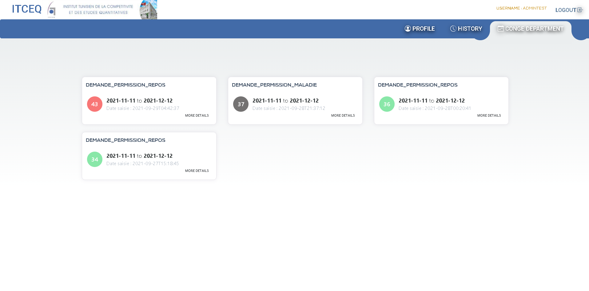

# Web application for leave management : ( Front using Angular ) 

## creenshots
Use Case Diagram

The manager can add employees, departments, department heads and assign each of them to another. 

The employee will log in using a username and email address that was sent to him in the mail. 
He can check and update certain information in his profile if necessary.

He can request leaves and check the history and status of his current requests.

For more security, every action performed by the employee, the department head or the manager will be saved and can be consulted in the history section. 

